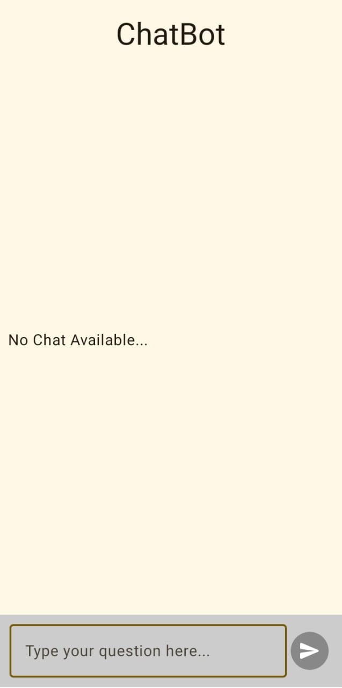
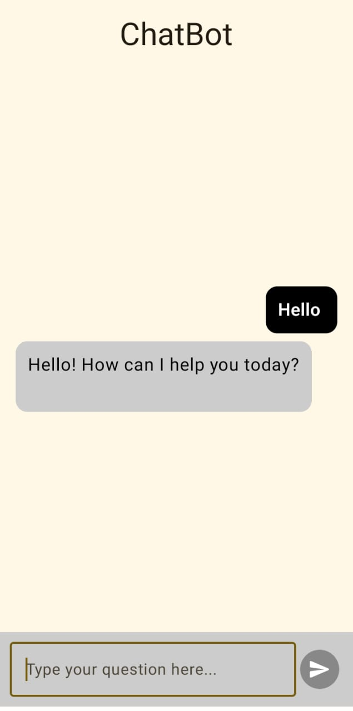

# Android ChatBot App

This Android ChatBot app uses the Gemini API to generate responses. It's built with Jetpack Compose and follows the MVVM architecture.

## Screenshots

See the app in action:

<p align="center">
  
</p>

---

<p align="center">
  
</p>

## Getting Gemini API Key

To get your Gemini API key:

1. Visit [AI Studio](https://aistudio.google.com/).
2. Click on **get api key** and then **create api key**.
3. Copy your new API key.

## Setup Instructions

1. **Clone the Repository:**
   ```bash
   git clone https://github.com/Hassan-Nisar-Ch/ChatBot.git
   ```

2. **Open the Project in Android Studio**

3. **Add Your API Key:**
   Open the `local.properties` file in the project root and add the following line:
   ```properties
   geminiApiKey=YOUR_API_KEY_HERE
   ```

4. **Build and Run the Project** on your device or emulator.

## License

This project is licensed under the [Apache License 2.0](LICENSE).

